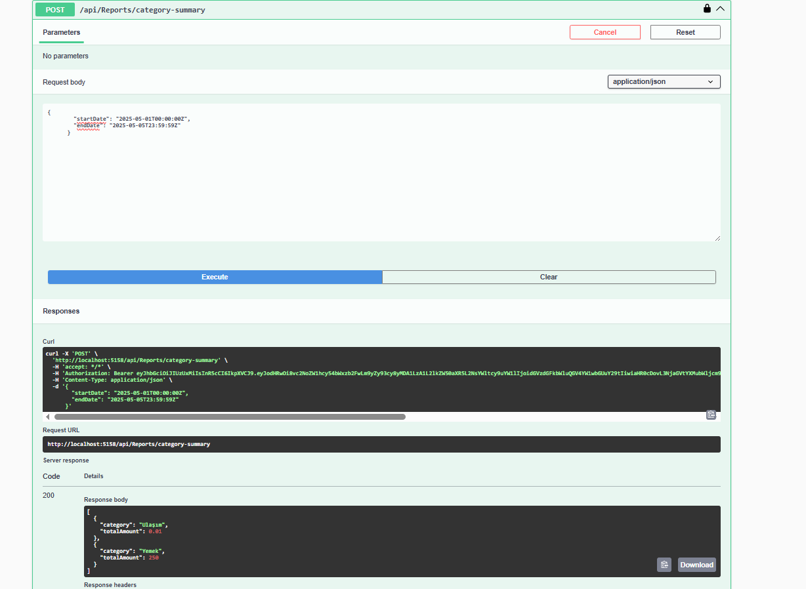
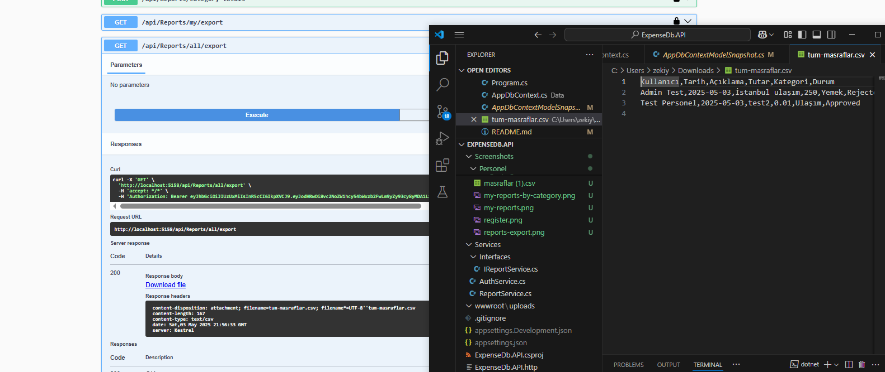

# ExpenseDb

**Masraf Yönetim Sistemi API**  
Patika.dev & Papara Kadın Yazılımcı Bootcamp bitirme projesi olarak geliştirilmiştir.

## Proje Özeti

Bu API, bir şirkette sahada çalışan personelin masraf taleplerini girmesi ve yöneticilerin bu talepleri yönetmesi amacıyla geliştirilmiştir.

- Personel, anında fiş/fatura yükleyebilir.
- Yöneticiler talepleri onaylayabilir veya reddedebilir.
- Onaylanan talepler için ödeme simülasyonu da bulunmaktadır.

## Kullanıcı Rolleri

### Admin (Yönetici)

- Tüm masrafları görüntüleyebilir
- Talepleri onaylayabilir / reddedebilir
- Kategori tanımları yapabilir
- Raporlama işlemleri yapabilir

### Personel (Saha Çalışanı)

- Kendi adına masraf girişi yapabilir
- Taleplerinin durumunu takip edebilir
- Red edilen masraflar için açıklamaları görebilir

## Kullanılan Teknolojiler

- ASP.NET Core Web API
- Entity Framework Core (Code First)
- PostgreSQL
- JWT ile Kimlik Doğrulama
- Dapper (Raporlama için)
- Swagger (API Dokümantasyonu)
- Role-Based Authorization
- CSV Export
- IFormFile ile belge yükleme
- Initial migration ile kullanıcı seedleme

## Kurulum

1. Repository'yi klonlayın:

   ```bash
   git clone https://github.com/zekiyeipek/ExpenseDb.git
   cd ExpenseDb.API
   ```

2. `appsettings.json` dosyasını kendi bağlantı bilgilerinize göre yapılandırın.

3. Veritabanı kurulumunu gerçekleştirin:

   ```bash
   dotnet ef database update
   ```

4. Uygulamayı başlatın:
   ```bash
   dotnet run
   ```

## 📸 Ekran Görüntüleri

### 🔐 Auth İşlemleri


### 👤 Personel İşlemleri


### 🛠️ Admin İşlemleri


### 📊 Admin Raporlama







